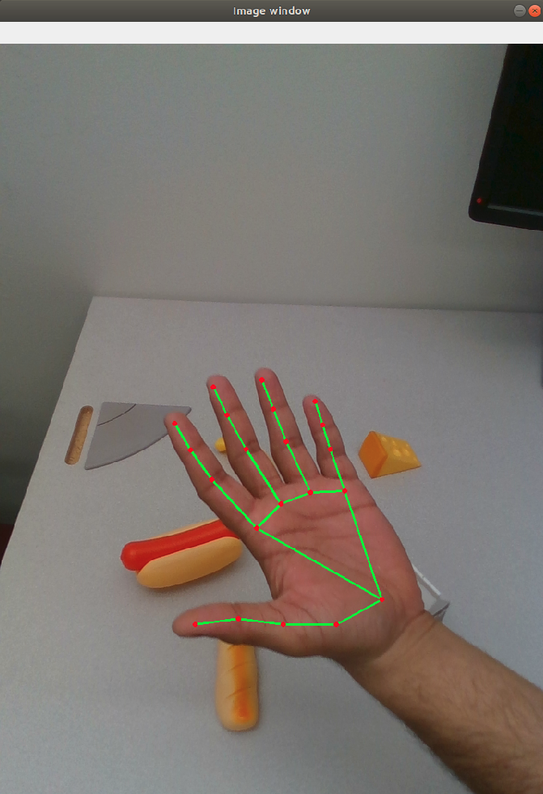
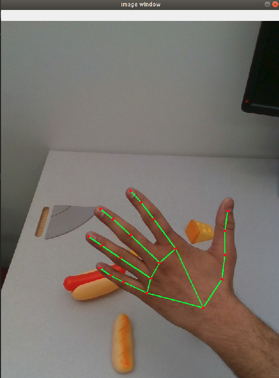
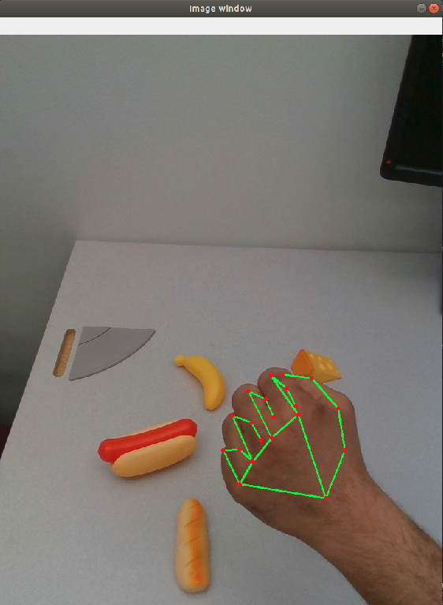
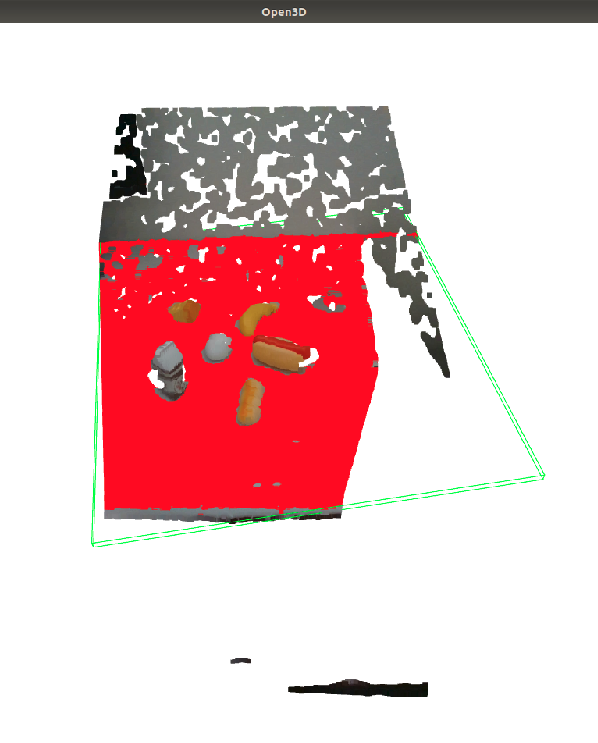
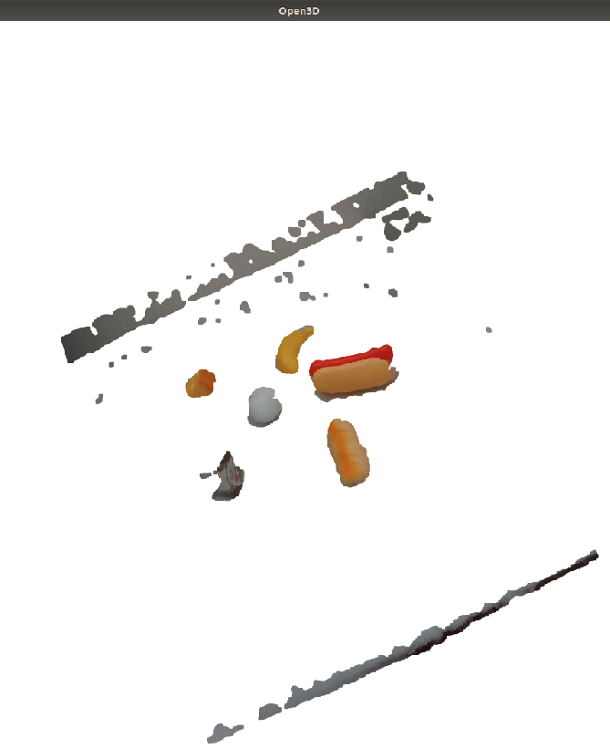
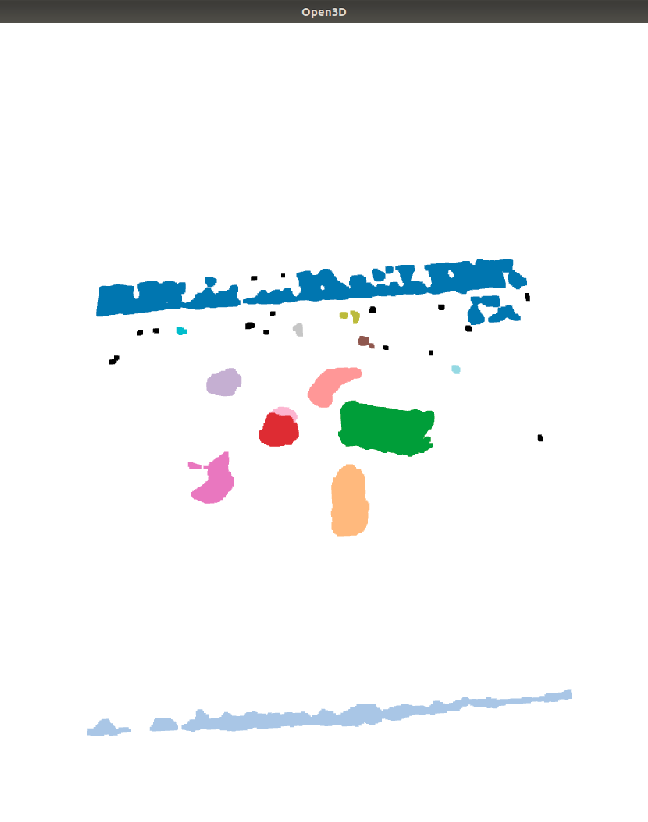

# ROS Perception Package

## Overview
`touri_perception` contains code that uses deep learning models to perceive and estimate the pose of objects in the world.

## Getting Started Demos

Currently, there exists 3 demos viz. `Cups pose estimation`,`depth_preprocessing` and `hands_pose_estimator`

### Cups pose estimation demo

To run the demo run:

```
roslaunch touri_perception detect_objects.launch 
rosrun touri_perception cups_pose_estimator.py
```


On running the demo, you should be able to see the following screen: 


You can use the keyboard_teleop commands within the terminal that you ran roslaunch in order to move the robot's head around to see your face.

```
             i (tilt up)
	     
j (pan left)               l (pan right)

             , (tilt down)
```

Pan left and pan right are in terms of the robot's left and the robot's right.


### Hands pose estimation demo

To run the demo run:

```
roslaunch touri_perception detect_objects.launch 
rosrun touri_perception hands_pose_detector.py
```


Description                    | Images
--------------------------     | -------------
Hands pose front               | 
Hands pose back                | 
Hands pose closed              | 


On running the demo, you should be able to see the following screen: 

You can use the keyboard_teleop commands within the terminal that you ran roslaunch in order to move the robot's head around to see your face.

```
             i (tilt up)
	     
j (pan left)               l (pan right)

             , (tilt down)
```

### Depth Preprocessing - Clustering Scene Objects Demo

To run the demo run:

```
roslaunch touri_perception detect_objects.launch 
rosrun touri_perception depth_preprocessing.py
```

Description                    | Images
--------------------------     | -------------
Point cloud with plane and oriented bounding box detection  | 
Cropped Point Cloud             | 
Clutered Point Cloud              | 

On running the demo, you should be able to see the following screen: 

You can use the keyboard_teleop commands within the terminal that you ran roslaunch in order to move the robot's head around to see your face.

```
             i (tilt up)
	     
j (pan left)               l (pan right)

             , (tilt down)
```

