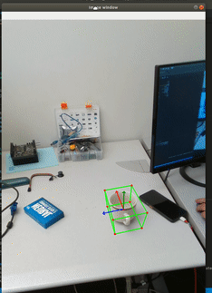

# ROS Perception Package

## Overview
`touri_perception` contains code that uses deep learning models to perceive and estimate the pose of objects in the world.

## Getting Started Demos

Currently, there exists a single demo - `Cups pose estimation`

### Cups pose estimation demo

To run the demo run:

```
roslaunch touri_perception detect_objects.launch 
```



On running the demo, you should be able to see the following screen: 


You can use the keyboard_teleop commands within the terminal that you ran roslaunch in order to move the robot's head around to see your face.

```
             i (tilt up)
	     
j (pan left)               l (pan right)

             , (tilt down)
```

Pan left and pan right are in terms of the robot's left and the robot's right.


